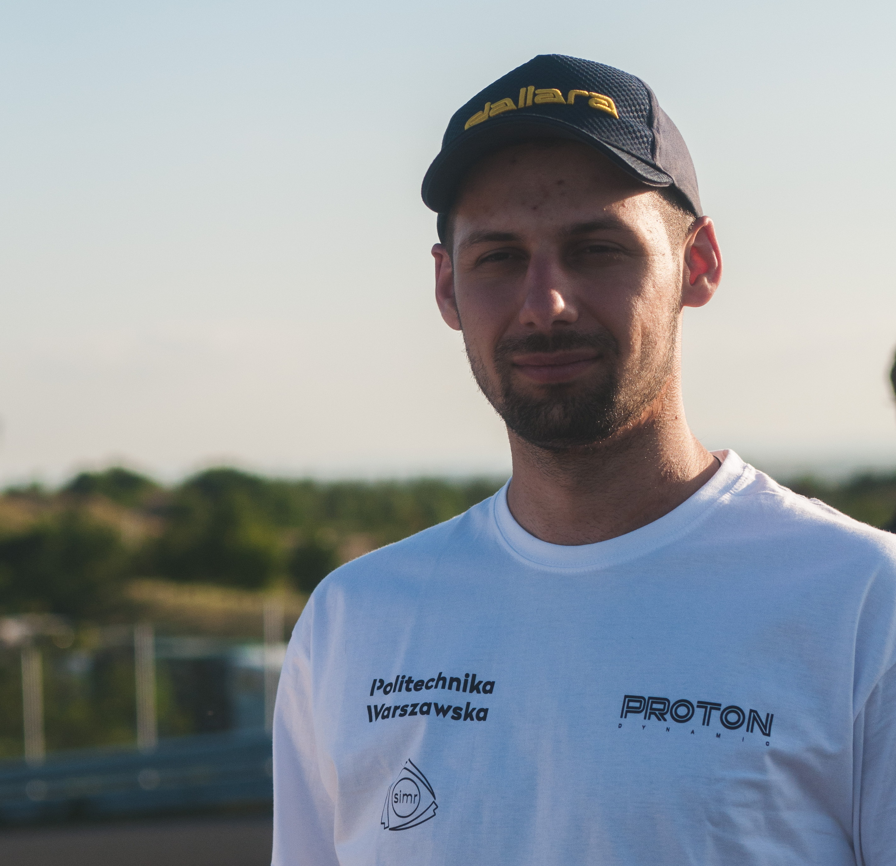

    <h2 id="photo-of-me" style="position:absolute; 
            margin-top: 1em;  
            top: 0;
            right:79%;">
        
    </h2>
    <h1 id="jarosław-królik">Jarosław Królik</h1>
    
 Python & Embedded Developer, Formula Student Team Member, Warsaw University of Technology Student.

    

        <a href="mailto:krolik.jaroslaw@gmail.com">krolik.jaroslaw@gmail.com</a>
        | <a href="tel:+48726074094">tel: +48 726-074-094</a>
        | <a href="https://j-krolik.github.io/">j-krolik.github.io</a>
        | <a href="https://www.linkedin.com/in/jaros%C5%82aw-kr%C3%B3lik">LinkedIn</a>
        | <a href="https://github.com/j-krolik">GitHub</a>
        | <a href="https://gitlab.com/j-krolik">Gitlab</a>
    

## Personal Profile

Extremely motivated to constantly develop my skills and grow professionally. Eager to take on new challenges. Always involved in the work of the team.

## Non-commercial Experience

`Feb'21-now`
__Software Team Leader, [Proton Dynamic](https://www.facebook.com/protondynamic) (The Electric Formula Student team)__

State current and long-term goals and tasks. Reorganized work by applying agile development methods. Providing training to members: our engineering tools, communication protocols used in vehicles, RTOS (real-time operating systems), safety critical systems requirements, software development methods, work organization. Supervising task accomplishment. Mentoring inexperienced members. 

Current projects:

1) PD-ECUs

Maintenance and development of the software embedded in ECUs (electronic control units). Our ECUs, similar to those in road vehicles, monitor the condition of the vehicle and allow driver controls the vehicle. Communication between ECUs and other electronic devices contained in the racing car are realized by CAN bus. The beginning of the current iteration of the software was realized by the framework that was created as part of my engineering thesis.

2) PD-logger-master

The main task of the team is to provide solutions for logging data generated by the car and processing it into formats that allow analysis by simulation teams. A Raspberry Pi based system is used for data logging, combined with a self built Pi HAT.

3) PD-logger-node

A project carried out by little experienced members, whose goal is to realize measuring ECUs. These bare metal devices measure electrical and non-electrical signals that are sent over the CAN network.

4) PD-bms

The purpose of this project is to develop a proprietary distributed high voltage battery management system (BMS). 

5) PD-web

Redevelopment of [our website](http://protondynamic.pl/), results coming soon. Support the PD-logger-master project.

`May'19-now`
__Software Engineer, Proton Dynamic__

Most of responsibilities are included with current projects listed above. Currently, I support projects on a much smaller scale.

`Oct'18-Sep'19`
__Electric Control And Safety Systems Designer, Proton Dynamic__

Create and develop solutions for the control and safety system applied in the Formula Student electric racing car.

## Education

`Feb'20-now`
__Master of Computer Science, Warsaw University of Technology__

Specialization: Data Engineering

`Oct'16-Feb'20`
__Bachelor of Mechatronics, Warsaw University of Technology__

Specialization: Electronic Measuring System

Theist: Implementation of the electronic control units in a Formula Student racing car. 

`Sep'12-Feb'16`
__Mechatronics Technical, Mechatronic Technical High School No. 1, Warsaw__

Projects:

* Rubik's Cube Solver, 2013 - own project, [youtube](https://youtu.be/PhV4bdIuPPM)
* 3wayhybrid, 2014 - 4-person team (responsible for software), [youtube](https://youtu.be/7ttGhVLnAEw)
* A modular device to enhance safety and make life easier, 2014 - 2-person team
* Make yourself some pancakes, 2015 - 4-person team, [youtube](https://youtu.be/0GzHdNWsNfw)

### Computing

Python - NumPy, pandas, scikit-learn, pyplot, skimage, seaborn, jupyter, cv2 (OpenCV), matplotlib, FastAPI, sqlite3, python-can

Embedded - AVR (in the past), Cortex-M (STM32), C, C++, RTOS (freeRTOS), CAN (CANopen), SPI, I2C, UART, DMA

SQL - mySQL, NoSQL - mongoDB, neo4j

Others - git, Docker, bash, wsl2, MS Excel, agile, Kanban

### Skills

Knowledge of classification and prediction methods such as trees, regression, SVD, neural networks

Basic knowledge of statistics

Knowing how to quickly find information in documentation and sites like stackoverflow

Capacity to work individually and as part of a team

Ability to work under pressure

## Languages

English - B2, ability to read and write documentation, speaking requires practice

## Free Time

MTB riding

Book reading, fantasy

## GDPR

I hereby give consent for my personal data included in my application to be processed for the purposes of the recruitment process under the European Parliament's and Council of the European Union Regulation on the Protection of Natural Persons as of 27 April 2016, with regard to the processing of personal data and on the free movement of such data, and repealing Directive 95/46/EC (Data Protection Directive)

